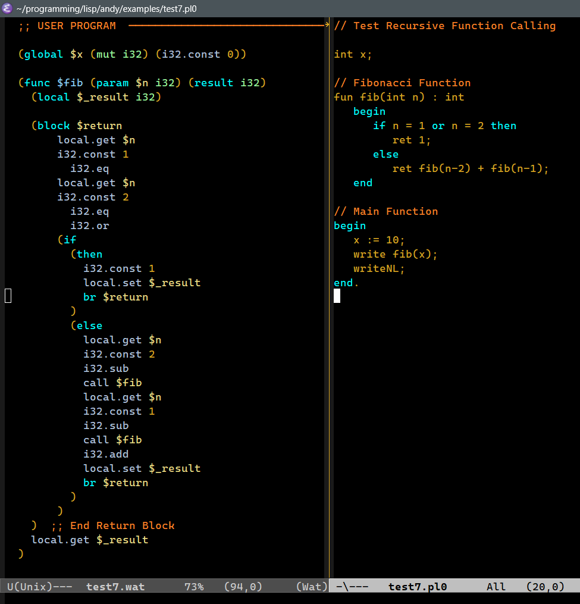

# ANDYC - Andy's PL/0+ Compiler written in Common Lisp

This project is an implementation of a **PL/0 compiler** written in **Common Lisp**.
The goal is to study compiler construction by following Wirth’s classic PL/0 language, while exploring modern backends such as **WebAssembly (WASM)**.

## About PL/0

PL/0 is a small teaching language introduced by Niklaus Wirth in *Algorithms + Data Structures = Programs* (1976).

It has:
- Constants, variables, and procedures
- Arithmetic expressions and conditions
- Control flow with `if` and `while`
- Structured blocks using `begin ... end`

It is deliberately minimal, making it ideal for educational compiler projects.

## Updates
The language has been updated with:
  - C-style line comments (//).
  - 32-bit integer types.
  - Immutable ASCII strings.
  - if-then-else statements.
  - switch-case-default statements.
  - Logical operators: and, or, xor
  - write and writeNL statements.
  - Loop break statements (break from while and switch)
  - Functions
  
  The language is becomming more Pascal and C-like in every new release.
  
### Example Program

```pl0
// What is the smallest number that can be divided by
// each number from 1 to 10, without remainder. 

const int inf = 1000000;	// Do not "infinite loop"

int i, n, result, continue;

begin
   n := 10;			// Number to investigate
   continue := 1;		// OuterLoop continuation state
   while n < inf and continue = 1 do
      begin
         n := n + 1;		// OuterLoop iter index
         result := 1;		// Innerloop continuation
         i := 2;		// InnerLoop index
         while result = 1 and i <= 10 do
	    begin
	       if n % i # 0 then
	          result := 0;
	       i := i + 1;	// InnerLoop iteration
            end
   if result = 1 then		// Bail, if answer found
      continue := 0;
   end
   write n;
end.
```

## Project Structure

```text

src/
  main.lisp      ; Main program driver
  ast.lisp       ; Abstract syntax tree (AST) definitions  
  lexer.lisp     ; Tokenizer for PL/0 source code
  parser.lisp    ; Recursive-descent parser for PL/0 grammar
  analyzer.lisp  : Symbol table generator and symantic checking
  runtime.lisp   : Emit runtime functions to WAT output file
  emitter.lisp   ; Code generator for IR / WASM

inc/
  io.wat         : IO Runtime Functions in WAT format

exampless/
  *.pl0          ; Example PL/0 programs for testing
```

## Getting Started

### Requirements
- Common Lisp implementation (tested with **SBCL** and **CCL**)
- [Quicklisp](https://www.quicklisp.org/) package manager
- [SLIME](https://common-lisp.net/project/slime/) for Emacs integration (recommended)

### Building the Project

Clone the repository:

```bash
git clone https://github.com/asuttles/andy.git
cd andy
```
```lisp
(ql:quickload :andy)
(andy.main:compile-source "tests/test1.pl0")
```
## Example Output


## References

Niklaus Wirth, Algorithms + Data Structures = Programs, 1976

The PL/0 Grammar

## More Information

For more information about the project, see [Project Notes](./project-notes.org).

## License
MIT License. See [LICENSE](./LICENSE) for details.
